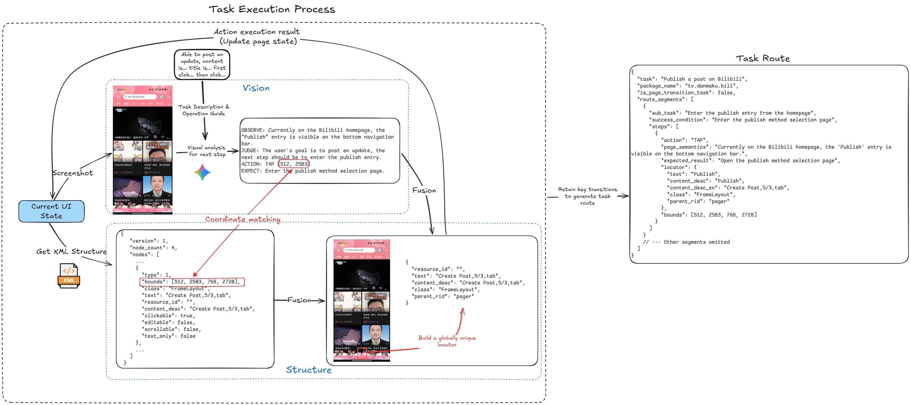

<div align="center">


# AutoLXB

**Experimental Android automation framework for repetitive, linear daily tasks**

[](LICENSE)
[]()
[](https://github.com/wuwei-crg/AutoLXB/releases)

**English** | [中文](README.zh.md)

</div>

AutoLXB is an on-device automation framework for real Android phones. It uses a **Route-Then-Act** design: every task first tries to reuse its own saved route asset for deterministic page navigation, and the vision model handles the dynamic UI interactions that the route cannot cover.

The project targets repetitive, linear, triggerable phone tasks such as scheduled check-ins, notification-based replies, and fixed-page information lookup or submission. It does not ask the model to freely explore the whole phone. Stable navigation is materialized into task routes, while unpredictable page content is handled by visual execution.

---

## Documentation & Demo

- **User manual**: [AutoLXB 使用手册](https://wuwei-crg.github.io/AutoLXB/)
- **Demo video**: [Bilibili BV1pDSSBKEvn](https://www.bilibili.com/video/BV1pDSSBKEvn)

The demo video shows the basic AutoLXB workflow. It does not cover task-route reuse; see the user manual for task-route editing, import/export, and Trace troubleshooting.

## Software Preview & Feature Overview


Core capabilities:

- **Quick tasks**: enter one natural-language request and run it immediately.
- **Scheduled tasks**: one-shot / daily / weekly execution, with list-level enable and disable controls.
- **Notification-triggered tasks**: trigger tasks from notifications by package, title, body, and optional LLM condition.
- **Task routes**: each task owns an isolated task route; execution matches routes by task identity instead of reusing routes from similar task descriptions.
- **Route editor**: review the captured trace after a run, remove noisy actions, and save the remaining actions as the task route.
- **Task import / export**: scheduled tasks and notification-triggered tasks can be exported as portable task JSON; import creates a new local task and binds the imported route to it.
- **Visual execution**: when the route cannot finish an interaction, a VLM observes the current screenshot, decides the next action, and executes taps, swipes, input, or back actions.
- **Root / Wireless ADB startup**: rooted devices can start core directly; non-root devices use Wireless ADB pairing and startup.
- **Trace logs**: structured core events for runtime state, FSM transitions, route replay, visual actions, and failure reasons.

## How It Works

The runtime core is `lxb-core`. The Android app manages startup, configuration, task management, and log viewing. `lxb-core` runs as an `app_process` background process and owns the task state machine, page routing, visual actions, and task-route storage.


After a task enters core, the FSM runs these stages:

1. **Initialize variables**: read screen size, current Activity, installed app candidates, input capability, unlock policy, and other runtime context.
2. **Task-route hit check**: compute the task `route_id`; if route mode is enabled and a usable route exists, restore the route's sub-task structure. If no route is available, continue through the normal task flow.
3. **Task decomposition**: split the user request into ordered sub-tasks; if decomposition fails, run a single fallback sub-task.
4. **App resolution**: determine the target app for the current sub-task; if a route hit already provides the package name, this stage can be skipped.
5. **Device preparation**: launch or switch to the target app and perform required preparation such as unlock.
6. **Page routing**: replay task-route steps first; completed route, missing route, route failure, and unrecoverable route failure are explicit branches.
7. **Visual execution**: use the current screenshot, task text, and execution history to let the VLM choose actions until the sub-task completes, fails, or reaches the turn limit.

A route hit keeps execution on deterministic replay whenever possible. A missing or unrecoverable route falls back to visual execution. Visual actions are recorded and can later be assembled into a task route.

## Task Route Generation



A task route is materialized from a real task execution. During execution, the system records two kinds of evidence:

- **Visual evidence**: screenshots, model observations, model actions, and expected results.
- **Structural evidence**: XML / accessibility nodes, bounds, text, content description, resource id, class, parent features, and related UI attributes.

When the vision model outputs a tap, input, or swipe, core fuses the action result, visual observation, and XML structure. For tap actions, it tries to build a reusable locator and records the locator, container probe, tap point, and semantic note into the trace. When the route is saved, these trace actions are assembled into route segments and steps.

Task-route targeting uses a layered stability strategy:

1. **Locator targeting**: prefer XML-based features such as text, content description, resource id, class, parent relation, and peer index.
2. **Container probing**: when a locator is not enough, validate the clickable container around the original tap point.
3. **Local coordinate fallback**: when the UI cannot be expressed reliably, keep a local tap point or fallback point for this device.
4. **Semantic adaptation**: portable export converts coordinate-backed taps into semantic descriptions; after import on another device, first replay uses the vision model to adapt each semantic description into a local locator / container / coordinate step and writes the materialized step back to the local route asset.

This design lets repeated local execution prefer deterministic targeting while giving exported tasks a way to adapt coordinate-backed steps on another device.

## Product Shape

The app is organized into four main pages:

- **Home**: start / stop core, view runtime status, and enter first-time setup.
- **Tasks**: manage quick tasks, schedules, notification triggers, and recent runs; the automation header provides the portable-task import entry.
- **Config**: configure control mode, device-side LLM / VLM, unlock and lock policy, language, and optional route source settings.
- **Logs**: inspect structured trace events, open event details, and export local traces.

Task automation includes:

- Quick tasks: one-off execution without a saved task configuration.
- Scheduled tasks: run at a configured time or recurrence; the task configuration owns a stable ID.
- Notification-triggered tasks: run when a notification rule matches; the rule owns a stable ID.
- Recent runs: inspect runtime result and trace information.

## Requirements

Before starting, make sure:

- you are using a real Android device on **Android 11 (API 30)** or above
- for **Wireless ADB startup**: Developer Options, USB debugging, and Wireless debugging are enabled
- for **Root startup**: the device is rooted and can grant `su`
- an **OpenAI Chat Completions-compatible** LLM / VLM endpoint is configured
  - the app can complete `/chat/completions`
  - the Config page shows the resolved final request URL
- the selected model supports image understanding, otherwise visual execution and semantic adaptation cannot work properly

## Quick Start

### 1. Install and prepare your phone

1. Install the APK from [Releases](https://github.com/wuwei-crg/AutoLXB/releases).
2. Enable Developer Options and make sure these settings are enabled:
   - `USB debugging`
   - **USB debugging must stay enabled, otherwise process keepalive may fail**
   - non-root devices also need `Wireless debugging`
3. Some Chinese Android ROMs need extra adjustments:

   | ROM | Action |
   |-----|--------|
   | MIUI / HyperOS (Xiaomi, POCO) | enable `USB debugging (Security settings)` |
   | ColorOS (OPPO / OnePlus) | disable `Permission monitoring` |
   | Flyme (Meizu) | disable `Flyme payment protection` |

4. Set the battery policy of `AutoLXB` to **Unrestricted** to prevent background tasks from being killed by the system.

### 2. Start AutoLXB Core

- **Rooted device**: tap **Root startup** on the home page and confirm that `su` permission can be granted.
- **Non-root device**: tap **ADB startup** and complete Wireless ADB pairing once.
- After pairing, later startups usually only require Wireless debugging to stay enabled.

### 3. Configure the model

Open `Config -> Device-side LLM Config`, then fill in:

- `API Base URL`
- `API Key`
- `Model`

After saving, run the test to make sure the model can process images and return a valid result.

### 4. Create an automated task

AutoLXB works best for repeatable, linear, triggerable tasks. Prefer these two task types:

- **Scheduled tasks**: run a task at a specific time or recurrence, such as a daily app check-in.
- **Notification-triggered tasks**: listen to notifications from a selected app and run a task when conditions match, such as replying after a specific group message arrives.

Write task descriptions concretely, for example:

```text
Open an app, enter the check-in page, and complete the check-in
Open WeChat, enter a specific group chat, and reply to the person who just sent a message
Open a delivery app, enter the order page, and check the rider location
```

If you are not sure whether a task description is stable, run it once as a **Quick task** first. After the path works, save it as a scheduled task or notification-triggered task.

### 5. Optional: save a task route

For repeated tasks, enable task routes. After a run, open the route editor, keep useful steps, delete unrelated actions, and tap **Save route manually**. Future runs prefer this route before using the vision model, reducing model calls and uncertainty.

## Task Types

### Quick Tasks

Submit one natural-language task from the home page or quick-task area, for example:

```text
Open WeChat and send "hello" to File Transfer
Open Bilibili and publish a new post with title test and content test
```

Quick tasks are useful for trial runs, temporary actions, and model-configuration validation.

### Scheduled Tasks

A scheduled task contains:

- task name
- user task description
- optional target package
- optional Playbook
- one-shot / daily / weekly schedule
- optional screen recording
- route-mode setting

After a scheduled task is saved, it owns a stable `schedule_id`. Its route ID is:

```text
schedule:<schedule_id>
```

Changing the task description, execution time, or recurrence does not change `schedule_id`, so saved routes do not become invalid because of schedule-time edits. Imported scheduled tasks are disabled by default until the user reviews and enables them.

### Notification-Triggered Tasks

A notification-triggered task contains:

- required package match
- optional title / body match
- optional LLM condition
- optional task rewrite strategy
- automation task description after a match
- route-mode setting

After a notification rule is saved, it owns a stable rule ID. Its route ID is:

```text
notify:<rule_id>
```

Notification-trigger pipeline:

1. core reads the notification snapshot.
2. rules match package, title, body, and LLM condition.
3. a matched rule builds the automation task.
4. the task enters `CortexFsmEngine`.
5. the FSM looks up and replays the task route by `notify:<rule_id>`.

## Task Routes

AutoLXB uses task-scoped route assets. Routes are not shared globally by app, and they are not merged by task-text hash. Each saved task configuration owns its own route ID and route files.

### Route identity

Route identity is determined by task source:

| Task source | Route ID |
|------------|----------|
| Scheduled task | `schedule:<schedule_id>` |
| Notification-triggered task | `notify:<rule_id>` |
| Quick / manual task | task run ID |

Route files are stored under the device-side app data directory in `lxb_state/task_maps`. The store contains the official task map, latest attempt trace, latest successful trace, and index metadata. Storage filenames are sanitized, but the semantic route identity remains the `route_id` above.

### Route replay

When route mode is enabled, the FSM checks the task `route_id` before task decomposition:

- Usable route hit: restore route sub-tasks and route steps, then replay them first.
- Route miss: continue with task decomposition, app resolution, page routing, and visual execution.
- Route replay failure: record the failure reason and fall back to visual execution.
- Successful route replay with **Finish task directly after replay** enabled: finish the task immediately without later visual execution.

“Finish task directly after replay” is route behavior. It is saved together with the manual route and controls whether a successful replay ends the task.

### Route editor

The route editor reviews a captured trace from a task run:

- view latest captured trace and latest successful trace summaries
- remove unrelated actions
- tap **Save route manually** to assemble the remaining actions into the official task route
- delete the saved route for the task

The route editor edits route content. Portable task import / export entries are placed in task management and task configuration flows.

## Portable Task Import / Export

AutoLXB imports and exports a portable asset that contains both task information and the route. It is not a standalone coordinate script.

### Export

Export is available from task configuration pages:

- scheduled tasks are exported from the schedule configuration page
- notification-triggered tasks are exported from the notification-trigger configuration page

The exported JSON file is saved to:

```text
Downloads/LXB/Tasks/lxb-task-portable-<timestamp>.json
```

The exported file contains:

- `schema = task_route_asset.v1`
- `task_type`: `schedule` or `notify_trigger`
- `task_info`: task name, user task, package, Playbook, route mode, and other necessary information
- `task_config`: clean configuration needed to create a new task
- `finish_after_replay`
- `segments`: route segments and steps

The exported file does not carry source task ID, source route ID, run records, run timestamps, scheduled time, notification active time windows, or other data bound to the original device or original timing plan.

For tap steps:

- steps with a locator are exported as `local_locator`
- container-backed or coordinate-backed taps are exported as `semantic_tap` with target name, instruction, page context, and expected result
- local coordinates are not treated as cross-device facts; coordinate-backed taps must be adapted on the target device

### Import

Import is available beside the automation area on the Tasks page. After the user chooses a portable task JSON file, the app identifies the task type automatically:

- `schedule`: create a new scheduled task, disabled by default, and bind the route to the new `schedule:<schedule_id>`.
- `notify_trigger`: create a new notification-trigger rule, disabled by default, and bind the route to the new `notify:<rule_id>`.

After import, locator steps can participate in replay immediately. `semantic_tap` steps are adapted on first replay: the vision model observes the current target-device UI, materializes each semantic step into a local locator / container / coordinate step, and writes the result back to the local route. Adaptation failures are recorded in trace and route state.

## Recommended First Configuration Pass

After core is running, check these settings.

### 1. Control Mode Config

This page decides how taps, swipes, and input are executed:

- **Touch mode**: `Shell` / `UIAutomator`
- **Input mode**: installing **ADB Keyboard** is strongly recommended
- **Task-time Do Not Disturb**: do nothing / turn sound back on / fully mute

### 2. Device-side LLM Config

Fill in:

- `API Base URL`
- `API Key`
- `Model`

The config page supports:

- real resolved request URL preview
- multiple saved local LLM profiles
- masked API key display
- model test and sync to device

### 3. Unlock & Lock Policy

- auto unlock before route execution
- auto lock after task
- lockscreen PIN / password, only when swipe alone is not enough

### 4. Playbook

A Playbook is extra operational guidance for the automation executor. For apps without stable routes, unclear page text, or special flow requirements, provide a short and explicit Playbook in the task configuration.

## Trace & Debugging

The Logs page provides a structured trace viewer:

- each trace event is shown as an individual card
- tapping a card opens structured details
- latest traces load first
- older traces load on upward scrolling
- cached traces can be exported locally

When debugging FSM transitions, notification-trigger matching, route replay, semantic adaptation, or visual-action failure, the main evidence is the trace event name, `task_id`, `route_id`, state, failure reason, and step summary.

## Usage Notes

- Set the `AutoLXB` battery policy to **Unrestricted**.
- Keep task descriptions short, concrete, and ordered.
- Scheduled tasks and notification-triggered tasks are best for long-term use; quick tasks are best for trial runs.
- Review a route before saving it, and remove splash-screen actions, popup handling, or unrelated steps that are not part of the main task path.
- For cross-device exports, prefer apps whose controls expose clear text / content description / resource id. Pure-icon controls with no semantic XML require semantic adaptation, whose stability depends on model recognition and page consistency.
- Some ROMs behave better with `Shell`, others with `UIAutomator`, so test both paths.

## Developer Debug Workflow

After code changes, install a debug build to your phone:

1. connect the device and confirm `adb devices` can see it
2. go to `android/LXB-Ignition`
3. run:

```bash
./gradlew :app:installDebug
```

Then open the debug build of `AutoLXB` on the phone.

## Acknowledgements

The `app_process` daemon design is inspired by [Shizuku](https://github.com/RikkaApps/Shizuku).

AutoLXB implements its own Wireless ADB pairing, connection, and startup flow and does not depend on Shizuku at runtime. The project is also shared in the [LINUX DO community](https://linux.do/).

Third-party notices: [THIRD_PARTY_NOTICES.md](THIRD_PARTY_NOTICES.md)

## License

MIT. See [LICENSE](LICENSE).

## Star Trend

[](https://star-history.com/#wuwei-crg/AutoLXB&Date)
