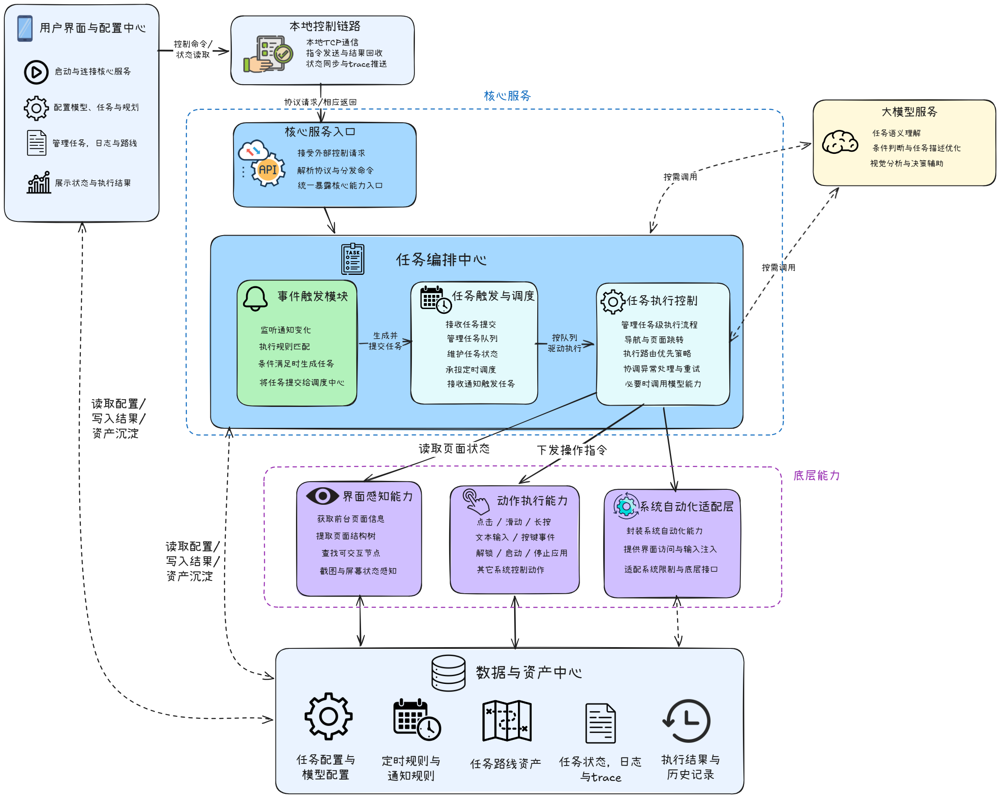

<div align="center">


# AutoLXB

**实验性安卓端自动化框架，专注于高频、线性的日常任务自动执行**

[](LICENSE)
[]()
[](https://github.com/wuwei-crg/AutoLXB/releases)

[English](README.md) | **中文**

</div>

AutoLXB 是一个运行在 Android 真机上的端侧自动化框架，主要面向重复、线性、可触发的手机任务，例如定时签到、收到通知后回复、进入固定页面读取或提交信息。

该项目采用 **Route-Then-Act** 设计：任务会先尝试复用本任务自己的路线资产完成确定性的页面跳转，路线无法覆盖的动态交互再交给视觉模型根据截图与界面状态执行。

---

## 使用文档与演示视频

- **使用手册**：[AutoLXB 使用手册](https://wuwei-crg.github.io/AutoLXB/)
- **演示视频**：[Bilibili BV114RbBfEou](https://www.bilibili.com/video/BV114RbBfEou)

使用手册包含任务创建、路线编辑、便携导入导出、配置说明和 Trace 排查等完整内容。

## 软件展示


## 快速开始

### 1. 安装与手机准备

1. 从 [Releases](https://github.com/wuwei-crg/AutoLXB/releases) 安装 APK。
2. 打开手机开发者选项，并确保以下开关已打开：
   - `USB 调试`
   - **必须开启 USB 调试，否则后台进程可能无法保活**
   - 无 Root 设备还需要打开 `无线调试`
3. 某些国产 ROM 需要额外设置：

   | ROM | 操作 |
   |-----|------|
   | MIUI / HyperOS（小米、POCO） | 开启 `USB 调试（安全设置）` |
   | ColorOS（OPPO / OnePlus） | 关闭“权限监控” |
   | Flyme（魅族） | 关闭“Flyme 支付保护” |

4. 建议将 `AutoLXB` 的电池策略设为 **无限制**，避免后台任务被系统杀掉。

### 2. 启动 AutoLXB Core

- **有 Root**：在首页点击 **Root 启动**，确认系统可以授予 `su` 权限。
- **无 Root**：在首页点击 **ADB 启动**，按引导完成一次无线 ADB 配对。
- 配对完成后，后续通常只需要保持无线调试打开，再点击 **ADB 启动**。

### 3. 配置模型

进入 `配置 -> 设备端 LLM 配置`，填写：

- `API Base URL`
- `API Key`
- `Model`

配置后点击测试，确认模型可以处理图片并返回结果。

### 4. 创建自动任务

AutoLXB 适合“重复、线性、可触发”的任务。建议优先使用下面两类任务：

- **定时任务**：在指定时间或周期自动执行，例如每天早上打开某 App 完成签到。
- **通知触发任务**：监听指定 App 的通知，满足条件后自动执行，例如收到某个群聊消息后自动回复。

任务描述建议写得具体，例如：

```text
打开某 App，进入签到页面，完成签到
打开微信，进入某个群聊，回复刚刚发消息的人
打开外卖 App，进入订单页面，查看骑手位置
```

如果不确定任务描述是否稳定，可以先用 **快速任务** 试跑一次。确认任务路径稳定后，再保存为定时任务或通知触发任务。

### 5. 可选：保存任务路线

对于经常重复执行的任务，可以开启任务路线。任务执行后，在路线编辑页保留有用步骤、删除无关动作，然后点击 **手动保存路线**。后续执行会优先按该任务路线跳转，减少视觉模型调用和不确定性。

## 示例任务

[`sample_tasks`](sample_tasks/) 目录提供了几份可直接在 AutoLXB 任务页导入的便携任务示例：

- `baidu-tieba-one-click-sign-in.json`：百度贴吧一键签到定时任务。
- `bilibili-text-post.json`：Bilibili 图文动态发布定时任务。
- `luckin-coconut-latte-order.json`：瑞幸咖啡生椰拿铁下单路线示例。

## 环境要求

开始前请确认：

- Android **11（API 30）** 及以上真机。
- 使用 **Wireless ADB** 启动时：已打开开发者选项、USB 调试、无线调试。
- 使用 **Root** 启动时：设备已 Root，且能授予 `su` 权限。
- 已配置兼容 **OpenAI Chat Completions** 风格的 LLM / VLM 接口。
- 所选模型需要支持图像理解能力。

## 更多文档

- [快速开始](https://wuwei-crg.github.io/AutoLXB/getting-started/install/)
- [任务教程](https://wuwei-crg.github.io/AutoLXB/tasks/overview/)
- [配置说明](https://wuwei-crg.github.io/AutoLXB/config/overview/)
- [Trace 日志](https://wuwei-crg.github.io/AutoLXB/trace/overview/)

## 架构与任务流程

AutoLXB 由 Android App、`lxb-core` 后台进程、设备操控、模型调用、任务路线存储和结构化 Trace 日志组成。



任务运行时会进入状态机，先尝试命中本任务自己的已保存路线；如果没有可用路线，或路线回放不能完成任务，再降级到视觉执行。


任务路线来自真实执行过程。系统会结合截图、模型动作和 XML / accessibility 结构，把有用的页面跳转动作保存成可复用的路线步骤。


## 致谢

`app_process` 守护进程的设计思路参考了 [Shizuku](https://github.com/RikkaApps/Shizuku)。

AutoLXB 自行实现了 Wireless ADB 配对、连接与启动流程，运行时不依赖 Shizuku。本项目也在 [LINUX DO 社区](https://linux.do/) 持续分享与交流。

第三方声明见：[THIRD_PARTY_NOTICES.zh.md](THIRD_PARTY_NOTICES.zh.md)

## 许可证

MIT，见 [LICENSE](LICENSE)。

## Star 趋势

[](https://star-history.com/#wuwei-crg/AutoLXB&Date)
