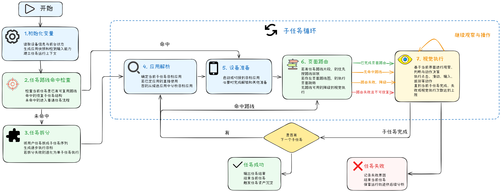

# 任务概览

AutoLXB 的任务页主要提供三种入口：**快速任务**、**定时任务** 和 **通知触发任务**。你可以先用快速任务试跑，确认任务描述可行后，再把它保存成定时任务或通知触发任务。

## 任务执行流程

下面这张图展示了一个任务从开始到结束的大致流程。作为用户，你不需要记住每个内部状态，只需要理解：AutoLXB 会先准备设备和任务上下文，再尝试使用任务路线完成固定页面跳转，最后把需要判断和操作的动态界面交给视觉模型处理。



简单来说：

1. **准备阶段**：读取设备状态、应用状态和输入能力。
2. **路线检查**：如果这个任务保存过路线，就优先尝试按路线走到目标页面。
3. **普通执行**：没有路线或路线不可用时，系统会分析任务、打开目标应用并进行页面跳转。
4. **视觉执行**：需要判断当前页面、点击按钮、输入内容时，由视觉模型观察屏幕并执行动作。
5. **结束或失败**：任务完成后记录结果；失败时可以在 Trace 中查看原因。

## 什么时候用哪一种？

| 任务类型 | 适合场景 | 举例 |
| --- | --- | --- |
| 快速任务 | 临时执行、试跑任务、验证模型配置 | “打开微信，给文件传输助手发 hello” |
| 定时任务 | 到点自动执行，或每天 / 每周重复执行 | 每天上午 9 点打开 App 签到 |
| 通知触发任务 | 收到某类通知后自动执行 | 收到某个群聊消息后自动回复 |

## 推荐使用流程

1. **先用快速任务试跑**：确认模型能理解任务，手机也能正常点击、滑动和输入。
2. **任务稳定后再自动化**：需要按时间执行就创建定时任务；需要被通知触发就创建通知触发任务。
3. **跑通后保存路线**：如果任务经常重复，可以保存任务路线，让后续执行更快、更稳定。
4. **失败时看日志**：任务失败后到日志页查看 Trace，确认是启动、匹配、路线还是视觉执行出了问题。

## 任务描述怎么写？

好的任务描述应该让模型知道三件事：

- 要打开哪个 App。
- 要进入哪个页面或找到哪个对象。
- 最后要完成什么动作。

推荐写法：

```text
打开微信，进入文件传输助手，发送一条消息：hello
打开瑞幸咖啡，进入点单页面，帮我点一杯热的生椰拿铁
打开某 App，进入签到页面，完成今日签到
```

不推荐写法：

```text
帮我弄一下
看一下消息
处理一下订单
```

这类描述太模糊，模型不知道目标页面和最终动作，失败率会明显升高。

## 任务路线开关是什么？

任务路线可以理解为“这件事以前怎么走过”。开启后，AutoLXB 会优先按保存过的路线完成页面跳转；如果没有路线，或者路线回放失败，就会继续使用视觉模型执行。

!!! tip "建议"
    第一次创建任务时，可以先不开路线。等任务跑通一次后，再到路线编辑页保存路线，然后回到任务配置里开启路线执行。