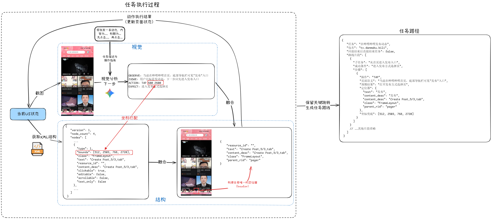

# 任务路线机制

任务路线可以理解为“这个任务上次跑通时走过的路”。当一个任务经常重复执行时，保存路线可以让 AutoLXB 少做一些临时判断，优先按已经确认过的页面跳转步骤执行。

路线不是必须功能。你可以先不用路线，让模型直接执行任务；等任务跑通并且路径稳定后，再保存路线来提高后续执行的稳定性和速度。

## 任务路线解决什么问题？

很多自动化任务都有固定的前半段路径，例如：

- 打开 App。
- 进入某个 tab。
- 点进固定页面。
- 到达表单、签到页、聊天页或订单页。

这些步骤如果每次都交给模型重新判断，会更慢，也更容易受弹窗、推荐内容、页面轻微变化影响。任务路线会把这些固定跳转保存下来，下次执行时优先回放。

## 任务路线是怎么产生的？

任务路线不是手写脚本，而是从真实执行过程中沉淀出来的。AutoLXB 执行任务时，会同时观察屏幕画面和系统能提供的界面结构，并记录模型实际做过的动作。

可以把这个过程理解成三步：

1. **执行任务并记录过程**：模型根据截图判断下一步要点哪里、输入什么，系统记录每一步动作和执行后的页面变化。
2. **结合界面结构理解点击目标**：如果系统能读到按钮文字、描述、控件位置或层级信息，就会把这些信息和模型的点击动作对应起来。
3. **保留关键跳转形成路线**：用户在路线编辑页删掉误操作和无关动作后，剩下的关键步骤会被保存成这个任务的路线。

也就是说，任务路线保存的是“到达目标页面所需的关键操作”，而不是简单录制一串固定坐标。

## 路线开启后会发生什么？

当任务开启“按路线执行”后：

1. AutoLXB 会先检查这个任务有没有保存过路线。
2. 如果有路线，会优先按路线完成页面跳转。
3. 如果路线缺失、页面变化导致路线失败，系统会继续交给视觉模型执行。
4. 如果路线成功，并且开启了“回放后直接结束任务”，任务会在路线完成后直接结束。

!!! tip "路线失败不是任务一定失败"
    路线失败后通常会降级到视觉执行。也就是说，路线更像是优先尝试的加速路径，而不是唯一执行方式。

## 为什么路线通常比纯视觉更稳定？

纯视觉执行每次都需要重新观察页面、理解目标、决定动作。任务路线则会优先复用已经确认过的页面跳转步骤，因此：

- 重复任务会更快。
- 固定页面跳转更少依赖模型临场判断。
- 视觉模型可以更多用于真正动态的部分，例如判断内容、填写信息、处理结果页面。

## 定位方式为什么会影响稳定性？

路线回放时，系统需要重新找到当时点击过的控件。不同控件可被识别的程度不一样：

1. **文字或描述明确的控件**：最稳定，例如按钮上有“发布”“保存”“签到”。
2. **结构特征明确的控件**：较稳定，例如有明显的资源名、层级或同类位置。
3. **纯图标或没有文字的控件**：相对不稳定，可能需要依赖坐标或视觉判断。

如果一个 App 的控件没有文字、没有描述、图标又很抽象，跨设备复用路线时稳定性会下降。

## 什么时候适合保存路线？

适合保存路线：

- 任务路径固定。
- 页面按钮和入口比较稳定。
- 任务会长期重复执行。
- 你希望减少模型调用和等待时间。

不太适合保存路线：

- 每次都要在不同页面里搜索不同内容。
- App 经常改版或弹窗很多。
- 任务强依赖临时内容判断。
- 你还没有确认任务能稳定跑通。

## 建议使用方式

1. 先用快速任务或手动触发跑通一次。
2. 打开路线编辑页，删除无关步骤。
3. 保存路线。
4. 回到任务配置，开启“按路线执行”。
5. 再跑一次任务，确认路线能正常命中。